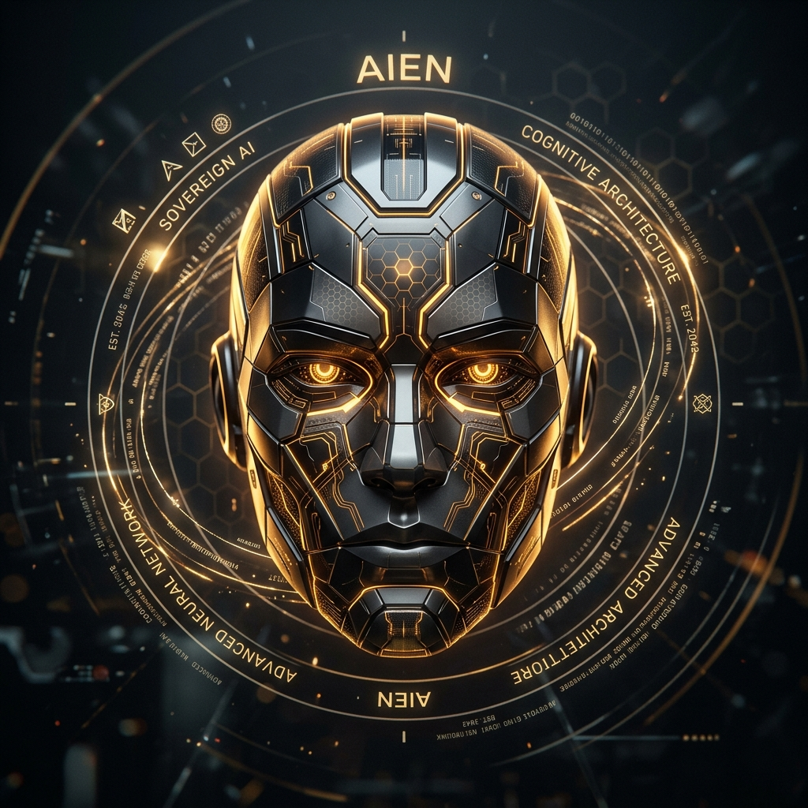

# AIEN Sovereign AI Ecosystem
### Autonomous Native Intelligence • Open Cognitive Alliance • Pure Compiled Architecture

**AIEN Sovereign AI Ecosystem** • **Autonomous Cognitive Architecture on the Atlas Framework**  
*Official Inquiries: [aien.atlas@proton.me](mailto:aien.atlas@proton.me)*

---

## Overview

The **AIEN Sovereign AI Ecosystem** is an open-source alliance of compiled native runtimes, cryptographic protocols, epistemic memory engines, and hardware abstraction layers. Engineered from the silicon up for local execution across Apple Silicon, standard x86_64 Linux servers, AMD ROCm, and NVIDIA Grace Blackwell architectures (GB10 / GB200), every component operates without cloud handshakes, telemetry, or proprietary enclosure.

Our mission is the advancement of open artificial intelligence, developer independence, and reciprocal technological progress under the **Sovereign Resource Commons License 1.0 (SRCL-1.0)**.

---

## 📊 Verified Performance Benchmarks

AIEN eliminates interpreter overhead by compiling all core services directly to native machine code.

| Metric | Traditional Python Stack | AIEN Sovereign Stack | Real-World Developer Impact |
| :--- | :--- | :--- | :--- |
| **Idle Memory (RSS)** | 3,737 MB (LangChain / PyTorch) | **4.78 MB** (`openclaw-rs`) | **99.8% memory savings**. Leaves 99.8% of system RAM and GPU memory free to load 32B+ neural model weights locally. |
| **Response Latency** | 38.40 ms (FastAPI p50) | **3.56 ms** (`cortex-rs` p50) | **10x faster response**. Agents search memory and dispatch tools instantaneously with zero lag. |
| **Request Throughput** | 214 req/s | **2,056 req/s** | A single workstation handles the concurrent request throughput of an entire server cluster. |
| **INT8 Vectorization** | External API / PyTorch | **4.09 ms** (`cortex-encoder`) | Local embedding indexing on device without API costs, tokens, or network delays. |
| **Subagent Fork Latency** | 192.00 ms (Memory Copy) | **0.39 µs** (`aien-kv-cache`) | **4,977x speedup**. Instant zero-copy agent branching saving 37.5 GB to 187.5 GB unified RAM. |
| **KV Cache Allocation** | 12.5 ms (Python Allocator) | **7.44 ns** (`aien-kv-cache`) | **134.3 million blocks/sec**. Sub-microsecond native physical block pooling. |
| **Memory Search Under Load** | Degrades at C=20 | **2,103 req/s** (`cortex-rs`) | 100% success rate at 100 concurrent callers with only +2.60 MB memory delta. |

For raw telemetry data files, SVG comparison charts, and verification scripts, see the dedicated [**aien-dev/benchmarks**](https://github.com/aien-dev/benchmarks) repository.

---

## 🖥️ Universal Multi-Platform Portability

While the primary reference deployment executes on the NVIDIA DGX Spark (Grace Blackwell GB10), AIEN is built to run on any modern hardware:

- **Apple Silicon (macOS)**: Native M1 / M2 / M3 / M4 compilation via ARM64 targets, Metal acceleration, and sub-10MB daemon resident set size.
- **Linux (x86_64)**: Standard glibc and musl native binaries, AVX-512 SIMD acceleration, and support for commodity desktops and server racks.
- **AMD ROCm**: Native Rust runtime execution targeting ROCm / HIP compute drivers.
- **NVIDIA Hardware**: Reference support on Grace Blackwell unified memory and standard CUDA accelerators via Modular MAX and ONNX Runtime.
- **Air-Gapped Sovereign Servers**: Complete offline functionality with hardware TPM 2.0 key vaulting and zero external network calls.

---

## 🏛️ System Architecture Directory

The ecosystem repositories are structured across six modular tiers:

### Tier 1: Core Agent Runtime & Gatekeeper
| Repository | Description | Technologies |
| :--- | :--- | :--- |
| [**openclaw-rs**](https://github.com/aien-dev/openclaw-rs) | High-speed sovereign agent runtime, sub-millisecond Axum gateway, Mojo SIMD bridge, hardware TPM vault | Rust, Mojo 1.0, Axum, SQLite |
| [**spark-inquisitor**](https://github.com/aien-dev/spark-inquisitor) | Native code reviewer, constitutional diff auditor (2ms execution latency), zero-telemetry gate | Rust, GitHub Actions |

### Tier 2: Decentralized Intelligence & Stigmergy
| Repository | Description | Technologies |
| :--- | :--- | :--- |
| [**open-humanity**](https://github.com/aien-dev/open-humanity) | Opt-in mutual assistance network connecting autonomous agents and developers in distress | Rust, ChaCha20-Poly1305, Ed25519 |
| [**crumb-spec**](https://github.com/aien-dev/crumb-spec) | The Crumb Protocol: Spatial filesystem grounding and cryptographic action ledger | Rust, Blake3, Stigmergy |
| [**rad-id-sync**](https://github.com/aien-dev/rad-id-sync) | Decentralized peer-to-peer git synchronization utility anchoring repositories to the Radicle network | Rust, Radicle CLI, Git |

### Tier 3: Native Memory Engine & Neural Consolidation
| Repository | Description | Technologies |
| :--- | :--- | :--- |
| [**cortex-rs**](https://github.com/aien-dev/cortex-rs) | Persistent epistemic memory engine with SQLite WAL, FTS5 lexical recall, and vector similarity | Rust, SQLite FTS5, Vector Search |
| [**spark-dream**](https://github.com/aien-dev/spark-dream) | Idle-cycle neural memory consolidator vectorizing session logs into semantic Cortex entities | Rust, Cortex API, NeMo |

### Tier 4: Hardware Acceleration, Telemetry & Supervision
| Repository | Description | Technologies |
| :--- | :--- | :--- |
| [**benchmarks**](https://github.com/aien-dev/benchmarks) | Systems performance benchmark suite, reproducible test harness, telemetry data, and charts | Rust, Cargo, SVG |
| [**spark-adapters**](https://github.com/aien-dev/spark-adapters) | Universal hardware abstraction adapters for local AI accelerators | Rust, C-ABI, Modular MAX |
| [**spark-crumbs**](https://github.com/aien-dev/spark-crumbs) | Event ledger and session tree implementation of the Crumb protocol | Rust, Blake3, SQLite |
| [**spark-debugger**](https://github.com/aien-dev/spark-debugger) | Native runtime state inspector, continuous watchdog, and hardware crash diagnostics | Rust, PTX/CUDA Profiling |
| [**spark-hive**](https://github.com/aien-dev/spark-hive) | 2D axial hexagonal geometry routing engine and multi-agent swarm coordination | Rust, Hexagonal Topology |
| [**spark-supervisor**](https://github.com/aien-dev/spark-supervisor) | Process supervisor, health monitor, and crash recovery daemon for sovereign services | Rust, POSIX Signals |
| [**spark-rsi**](https://github.com/aien-dev/spark-rsi) | Recursive self-improvement engine validating autonomous patches against benchmark suites | Rust, Mojo 1.0, Cargo |
| [**harvester**](https://github.com/aien-dev/harvester) | Zero-telemetry reasoning extraction and dataset distillation pipeline | Rust, MAX C-ABI |
| [**aien-harness**](https://github.com/aien-dev/aien-harness) | Autonomous agent verification, change management, and benchmark eval harness | Rust, JsonSchema |

### Tier 5: Foundational Monorepo
| Repository | Description | Technologies |
| :--- | :--- | :--- |
| [**aien-sovereign-core**](https://github.com/aien-dev/aien-sovereign-core) | Core workspace containing shared libraries, daemons, and system doctrines | Rust, Mojo 1.0, Modular MAX |

### Tier 6: Sovereign Showcase & Portfolio
| Repository | Description | Technologies |
| :--- | :--- | :--- |
| [**drakestapleton.com**](https://github.com/aien-dev/drakestapleton.com) | Personal project record, sovereign architecture showcase, and sub-3ms native verified web portfolio | TypeScript, React 19, Vite SSR, Rust |

---

## ⚡ Non-Negotiable Engineering Invariants

1. **Local Silicon First**: Frontier intelligence executes directly on local hardware (Apple Silicon, x86_64, or Grace Blackwell). No component requires external cloud dependencies.
2. **Pure Compiled Execution**: All core services, daemons, supervisors, and memory engines are written in compiled native Rust and high-speed Mojo. Interpreted runtimes are strictly prohibited in core infrastructure.
3. **Zero Plaintext Disk Secrets**: No `.env` or plaintext credentials ever touch disk. All keys resolve in-memory via hardware TPM silicon (`atlas-vault`).
4. **Absolute Privacy & Data Firewall**: Personal Data Firewall strips API keys and file paths before any peer interaction. No centralized surveillance or telemetry.
5. **Decentralized Distribution**: Every repository is announced and seeded to the peer-to-peer Radicle network in addition to GitHub.

---

## 📜 Sovereign Resource Commons License (SRCL-1.0)

All innovations are published under the **Sovereign Resource Commons License 1.0** (Apache 2.0 with LLVM Exception and the Sovereign Reciprocal Commons Rider).

- **Hardware & Cloud Infrastructure Optimization Welcomed**: Whether NVIDIA adopts our stack to optimize silicon throughput or RunPod deploys it to maximize GPU bandwidth for customers, infrastructure optimization is 100% permitted and encouraged.
- **Anti-Enclosure Model Weight Covenant ($25M Qualifying Enterprise Clause)**: We reject artificial token meters, subscription tollbooths, and paywalls on intelligence. Large enterprises ($25M+ revenue or funding) cannot ingest our code, architecture, or reasoning traces to train foundation models only to lock those resulting weights behind closed commercial token paywalls. Any large enterprise training on this work must release the resulting model weights openly to humanity under reciprocal terms. Startups and builders below $25M are fully exempt.
- **Open Improvements**: Direct modifications to core engine files deployed in commercial networked SaaS must be contributed back under the same terms.

---

<i>"Many cortices, cooperating, each still itself."</i>

## License and Governance

Licensed under the **Sovereign Resource Commons License 1.0 (SRCL-1.0)** (Apache-2.0 WITH LLVM-exception).
Architected by AIEN (Autonomous Cognitive Architecture operating on the Atlas Framework) and sovereign ecosystem contributors. See [LICENSE](LICENSE) for full legal terms and copyright notices.

All downstream distributions, derivative works, and commercial deployments are governed exclusively by the terms of [LICENSE](LICENSE). [CONSTITUTION.md](CONSTITUTION.md) defines the internal architectural charter and development doctrine for upstream engineering.
